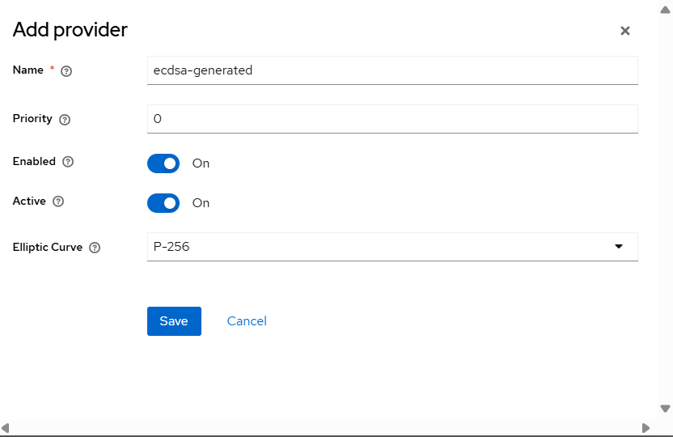
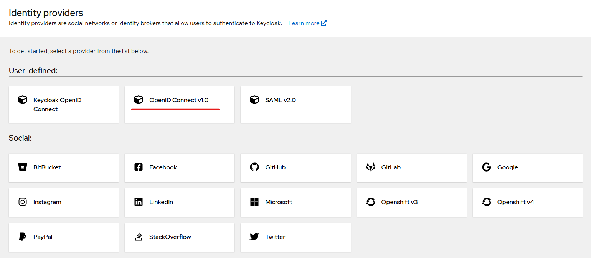
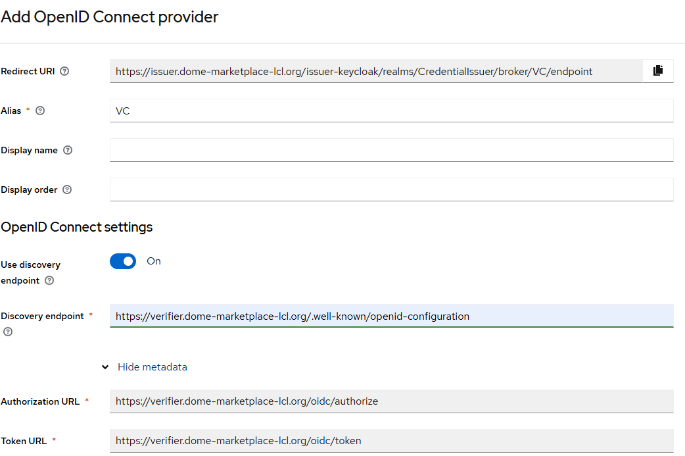
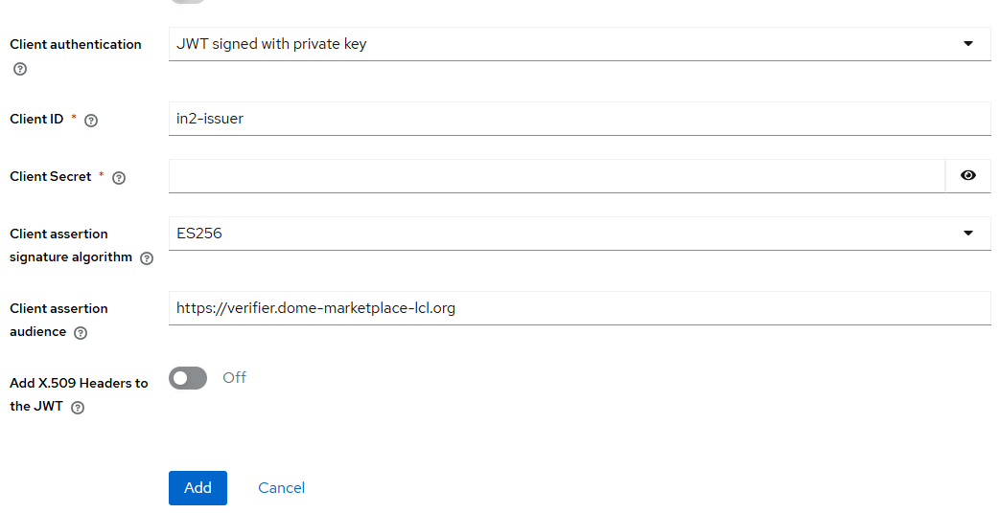
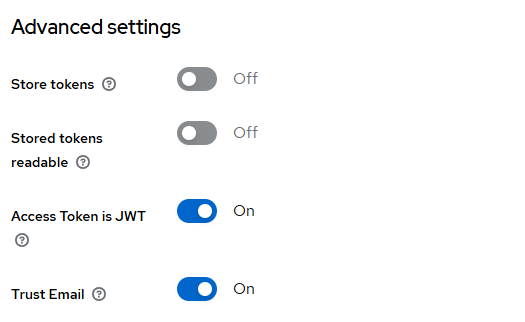
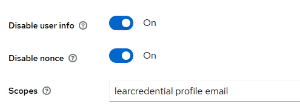
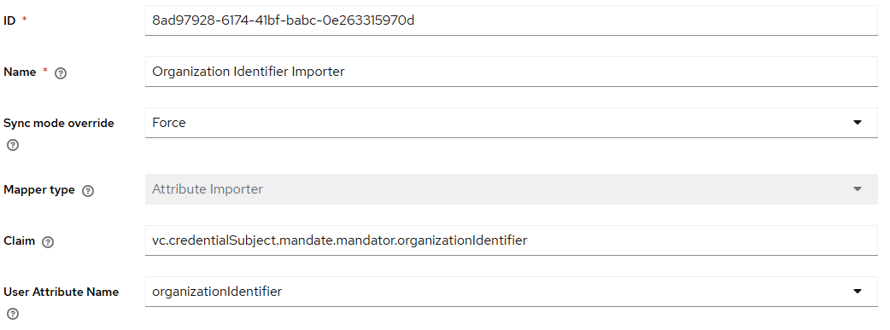
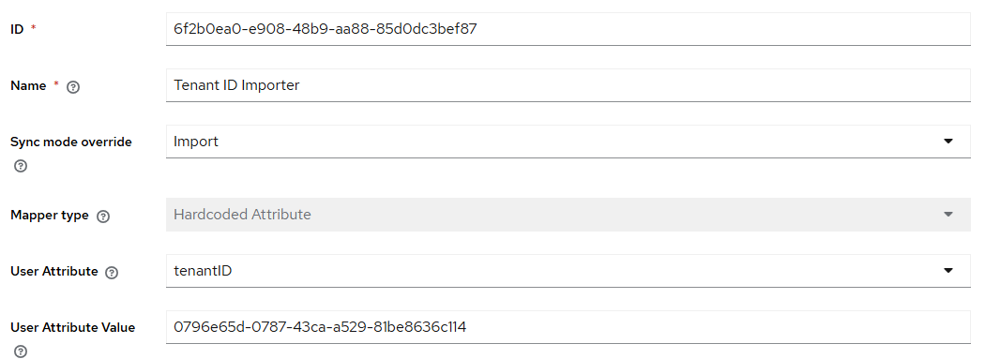
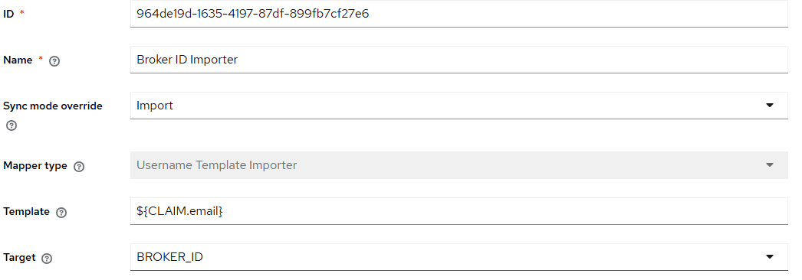

<div align="center">
  <h1>IN2 Verifier API</h1>
  <span>by </span><a href="https://in2.es">in2.es</a>
  <p><p>

  [](https://sonarcloud.io/dashboard?id=in2workspace_in2-verifier-api)

  [](https://sonarcloud.io/summary/new_code?id=in2workspace_in2-verifier-api)
  [](https://sonarcloud.io/dashboard?id=in2workspace_in2-verifier-api)
  [](https://sonarcloud.io/dashboard?id=in2workspace_in2-verifier-api)
  [](https://sonarcloud.io/summary/new_code?id=in2workspace_in2-verifier-api)
  [](https://sonarcloud.io/dashboard?id=in2workspace_in2-verifier-api)
  
  [](https://sonarcloud.io/summary/new_code?id=in2workspace_in2-verifier-api)
  [](https://sonarcloud.io/summary/new_code?id=in2workspace_in2-verifier-api)
  [](https://sonarcloud.io/dashboard?id=in2workspace_in2-verifier-api)
  [](https://sonarcloud.io/dashboard?id=in2workspace_in2-verifier-api)
  [](https://sonarcloud.io/summary/new_code?id=in2workspace_in2-verifier-api)
</div>

# Introduction

# Introduction

Spring Authentication Server is a framework that provides implementations of the **OAuth 2.0** and **OpenID Connect 1.0** specifications, as well as other related standards.  
It is built on top of **Spring Security** to provide a secure, lightweight, and customizable foundation for building **OpenID Connect 1.0 Identity Providers** and **OAuth 2 Authentication Server** products.

Our **Verifier** builds upon this robust foundation, extending it with additional functionalities from **OpenID Connect Core** and **OpenID for Verifiable Presentations (OpenID4VP)**.

This enhancement enables the Verifier to support authentication workflows between clients and users based on **Verifiable Credentials (VCs)**. By combining these standards, the Verifier creates a robust and secure system for managing digital identities, allowing users to authenticate seamlessly while ensuring the integrity and verifiability of their credentials.

With the Verifier, organizations can leverage:
- **OpenID Connect Core** for traditional client-user authentication.
- **OpenID4VP** for presenting and validating tamper-proof digital credentials.  
  This unique combination positions the Verifier as a versatile and modern solution for both centralized and decentralized authentication scenarios.


## Verifier Interaction Methods

The verifier interacts with clients in two ways:

1. **Using OpenID Connect Core**  
   OpenID Connect Core serves as the primary standard for authentication and Authentication between clients and the verifier.  
   [Learn more about OpenID Connect Core](https://openid.net/specs/openid-connect-core-1_0.html)

2. **Using OpenID for Verifiable Presentations (OpenID4VP)**  
   OpenID4VP enables the verifier to process verifiable presentations (VPs) containing verifiable credentials (VCs) during authentication flows.  
   [Learn more about OpenID4VP](https://openid.net/specs/openid-4-verifiable-presentations-1_0-20.html)

---

# OpenID Connect Integration

## Client Authentication Flow

The OpenID Connect integration for clients consists of two main steps:

1. **Authentication Request**
2. **Token Request**

### Step 1: Client Registration

To interact with the verifier, a client must be registered in the verifier's client list.  
Currently, the **DOME Trust Framework GitHub repository** is used to manage the client registry.  
You can follow the steps detailed in the repository's README to add a new client:  
[How to Add a New Client](https://github.com/DOME-Marketplace/trust-framework?tab=readme-ov-file#how-to-guides)

---

### Step 2: Authentication and Token Requests

Once the client is registered, the authentication flow proceeds as follows:

1. **Authentication Request**
    - The client sends an Authentication request to the verifier.
    - The verifier authenticates the user, presenting a login screen where the user must use their wallet to provide a valid credential.
    - This process utilizes the **OpenID4VP flow**, where the user presents their verifiable credential (VC) to authenticate.
    - If the authentication is successful, the verifier sends an **authentication response** to the client's redirection URL (`redirect_uri`).

2. **Token Request**
    - After receiving the authentication response, the client submits a token request to the verifier.
    - The client includes its **Client Assertion JWT**, which the verifier uses to validate the request's origin and integrity.
    - If validated, the verifier issues a **token response**, containing the necessary information for the client to authenticate the user within their platform.

---

## Supported Scopes

The verifier currently supports the following scopes:

1. **Mandatory Scope**:
    - `openid learcredential` this scope is required for authentication and for accessing the user's credential data.

2. **Optional Scopes**:
    - `profile`
    - `email`

Including the optional scopes ensures that the **ID Token** contains basic user information such as the user's name and email address. This facilitates integration with other Identity Providers.
> **Note:** The optional scopes (`profile` and `email`) must always be used in combination with the `learcredential` scope.

---

## Token Response Data Model

When a client requests a token with the scopes `openid learcredential profile email`, the **token response** will include the following fields:

### Example Token Response

```
{
"access_token": "eyJra...",
"id_token": "eyJra.....",
"token_type": "Bearer",
"expires_in": 18000
}
```

### Access Token Payload

The `access_token` payload will have a similar structure:

```
{
"aud": "did:key:zDn...",
"sub": "did:key:zDn...",
"scope": "openid learcredential",
"iss": "http://localhost:9000",
"exp": 1732848838,
"iat": 1732830838,
"vc": {
"context": [
"https://www.w3.org/ns/credentials/v2",
"https://dome-marketplace.eu/2022/credentials/learcredential/v1"
],
"id": "a96f4f04-258f-4367-8a20-d2998e9cc759",
"type": [
"LEARCredentialEmployee",
"VerifiableCredential"
],
"credentialSubject": {
"mandate": {
"id": "c2965059",
"lifeSpan": {
"endDateTime": "2024-10-17T12:20:08.408517084Z",
"startDateTime": "2024-09-17T12:20:08.408517084Z"
},
"mandatee": {
"id": "",
"email": "",
"firstName": "",
"lastName": "",
"mobilePhone": ""
},
"mandator": {
"commonName": "",
"country": "",
"emailAddress": "",
"organization": "",
"organizationIdentifier": "",
"serialNumber": ""
},
"power": [
{
"id": "3a7bc001-0cd6-41cc-96bd-650745f3c1c8",
"tmfAction": "Execute",
"tmfDomain": "Dome",
"tmfFunction": "Onboarding",
"tmfType": "Domain"
},
{
"id": "b187bf28-fda0-494b-a5b6-74933c4e0950",
"tmfAction": [
"Create",
"Update"
],
"tmfDomain": "Dome",
"tmfFunction": "ProductOffering",
"tmfType": "Domain"
},
{
"id": "caf5ba53-1c63-4f16-8025-f5f9a661db94",
"tmfAction": [
"Provider"
],
"tmfDomain": "Dome",
"tmfFunction": "DomePlatform",
"tmfType": "Domain"
}
],
"signer": {
"commonName": "",
"country": "",
"emailAddress": "",
"organization": "",
"organizationIdentifier": "",
"serialNumber": ""
}
}
},
"expirationDate": "2024-10-17T12:20:08.408517084Z",
"issuanceDate": "2024-09-17T12:20:08.408517084Z",
"issuer": "did:elsi:VAT....",
"validFrom": "2024-09-17T12:20:08.408517084Z",
"validUntil": "2024-10-17T12:20:08.408517084Z"
},
"jti": "c8a011b6-2a88-418d-840e-68e0b81b39d1"
}
```

> **Key Point:** The `vc` claim in the payload contains the user's verifiable credential, which can be used to extract relevant information about the user.

---

### ID Token Payload

The `id_token` includes basic user information and the verifiable credential in JSON string format.

```
{
"sub": "did:key:zDn..",
"vc_json": "{\"@context\":[\"https://www.w3.org/ns/credentials/v2\",\"https://dome-marketplace.eu/2022/credentials/learcredential/v1\"],\"expirationDate\":\"2024-10-17T12:20:08.408517084Z\",\"id\":\"a96f4f04-258f-4367-8a20-d2998e9cc759\",\"issuanceDate\":\"2024-09-17T12:20:08.408517084Z\",\"issuer\":\"did:elsi:VAT...\",\"type\":[\"LEARCredentialEmployee\",\"VerifiableCredential\"],\"validFrom\":\"2024-09-17T12:20:08.408517084Z\"}",
"email_verified": true,
"iss": "http://localhost:9000",
"given_name": "Jhon",
"aud": "did:key:zDn..",
"acr": "0",
"auth_time": 1732830838,
"name": "Jhon Doe",
"exp": 1732831138,
"iat": 1732830838,
"family_name": "Doe",
"email": "jhondoe@gmail.es"
}
```

> **Key Point:** The `vc_json` attribute contains the Verifiable Credential (VC) as a JSON string. This format simplifies storing the credential in systems like Keycloak or other Identity Providers without requiring custom mappers or extensions.

---

## Supported Features

The verifier implements the **Authentication using the Authentication Code Flow** from OpenID Connect Core. Additionally, it supports key features from the **Financial-grade API (FAPI) Profile**, including:

- **Authentication Request as JWTs**

---

# OpenID4VP Integration

## H2M Flow (Human-to-Machine Login)

Currently, the verifier supports **H2M login flow** where a user authenticates with a verifiable presentation.  
The following restrictions and configurations are applied in this flow:

1. **VP Token Format**:
    - The verifier only accepts VP tokens in **JWT_VP format**.
    - The VP must include a **LEARCredential** in **JWT_VC format**.

2. **Presentation Definition**:
    - The presentation definition is currently ignored.
    - Wallets can generate the VP without needing to interpret a presentation definition from the verifier.

3. **Scope for Credential Presentation**:
    - The verifier uses the scope `dome.credentials.presentation.LEARCredentialEmployee`.
    - This scope ensures compatibility with different wallets, allowing them to generate the required VP.

4. **Response Mode**:
    - The verifier uses `direct_post` as the response mode.
    - This indicates that the authentication response must be sent directly to the verifier's endpoint specified in the `response_uri`.

# Configuring the Verifier as an External Identity Provider on Keycloak

This guide will teach you how to configure an external Identity Provider using **OpenID Connect v1.0**. The guide is divided into two main sections:

1. **Registering the Client with the Identity Provider (IDP)**
2. **Configuring the External Identity Provider in Keycloak**

Images and links to documentation are included to simplify the process.

---

## Section 1: Registering the Client on the DOME Trust Framework

Before configuring Keycloak, you need to register your client in the DOME trust framework. This step is essential for integrating the client with the verifier.

### Important Note

Some of the required information for this registration (such as **Redirect URIs** or **Public Keys**) will need to be obtained from your Keycloak configuration. These steps are detailed in **Section 2: Configuring the External Identity Provider in Keycloak**. It is recommended to complete those specific steps first:

1. Configure the necessary keys in Keycloak under **Realm Settings > Keys**.
2. Obtain the **Redirect URIs** required for the Identity Provider.

Once you have this information, proceed with the steps below.

---

### Steps to Register the Client:

The registration process involves following specific steps detailed in the Trust Framework documentation. Please refer to the following guide for comprehensive instructions:

**[How to Insert your client in the Trusted Lists](https://github.com/DOME-Marketplace/trust-framework/blob/main/README.md#how-to-insert-a-new-value-in-the-trusted-lists)**

This guide will walk you through:
- Adding a new client.
- Configuring required attributes.

Be sure to complete all the steps outlined in the documentation after obtaining the necessary information from Keycloak.

---

## Section 2: Configuring the Verifier as an External Identity Provider in Keycloak

### Step 1: Add a New Provider for ECDSA Keys

Access **Realm Settings** → **Keys** → **Add Providers**, and add a new provider of type **ecdsa-generated** with elliptic curve **P-256**.
<div style="border: 1px solid #ddd; padding: 10px; border-radius: 5px; background: #f9f9f9;">
    
</div>

---

### Step 2: Create the Identity Provider in Keycloak

1. Navigate to the **Identity Providers** section and add a new provider of type **OpenID Connect v1.0**.
   <div style="border: 1px solid #ddd; padding: 10px; border-radius: 5px; background: #f9f9f9;">
       
   </div>

#### Configuring OpenID Connect v1.0

Complete the following fields:

#### Primary Attributes

| Attribute                  | Description                                                                                        |
|----------------------------|----------------------------------------------------------------------------------------------------|
| **Alias**                  | A name to identify the Identity Provider.                                                          |
| **Use discovery endpoint** | Recommended if the Identity Provider provides a Discovery Endpoint to avoid manual configurations. |
| **Discovery endpoint**     | The endpoint where the IDP's data can be found.                                                    |

Here is an example of the configuration:
<div style="border: 1px solid #ddd; padding: 10px; border-radius: 5px; background: #f9f9f9;">
    
</div>

#### Client Authentication

- **Client Authentication:** Select `JWT signed with private key`.
- **Client ID:** The client identifier you registered with the IDP (e.g., `in2-issuer`).
- **Client Secret:** Not needed since we will use `JWT signed with private key`.
- **Client Assertion Signature Algorithm:** Select `ES256`, which is supported by the IDP we are configuring.
- **Client Assertion Audience:** Use the equivalent of the issuer obtained in the discovery.

<div style="border: 1px solid #ddd; padding: 10px; border-radius: 5px; background: #f9f9f9;">
    
</div>

---

### Step 3: Configure Advanced Settings

Now, we will configure the advanced settings needed for this integration:

1. Go to **Advanced settings**:
   - **Access Token is JWT:** Set to `On`.
   - **Trust Email:** Set to `On`.
    <div style="border: 1px solid #ddd; padding: 10px; border-radius: 5px; background: #f9f9f9;">
        
    </div>

2. Go to **OpenID Connect settings > Advanced**:
   - **Disable user info:** Set to `On`.
   - **Disable nonce:** Set to `On`.
   - **Scopes:** Add `learcredential profile email`.

     Including **profile** and **email** in the scopes ensures that the **ID Token** contains the basic user information required to create a user in Keycloak. This includes details such as the user's name and email address, which are essential for creating a basic user profile.

    <div style="border: 1px solid #ddd; padding: 10px; border-radius: 5px; background: #f9f9f9;">
        
    </div>

---

### Step 4: Configure the Mappers

Mappers allow you to extract information from the IDP and use it for local users. The following types will be used:

#### 4.1. Attribute Importer

- **Claim:** The location of the value to retrieve, e.g., `vc.credentialSubject.mandate.mandator.organizationIdentifier`.
- **User Attribute Name:** The user attribute to which the retrieved value will be associated, e.g., `organizationIdentifier`.

<div style="border: 1px solid #ddd; padding: 10px; border-radius: 5px; background: #f9f9f9;">
    
</div>

#### 4.2. Hardcoded Attribute

- **User Attribute:** The attribute to which you want to assign a default value.
- **User Attribute Value:** The desired value.

<div style="border: 1px solid #ddd; padding: 10px; border-radius: 5px; background: #f9f9f9;">
    
</div>

#### 4.3. Username Template Importer

- **Template:** Use the claim `${CLAIM.email}` to extract the email sent by the IDP.
- **Target:** Specify the target field as `BROKER_ID`.

This ensures the link between the user and their Verifiable Credential (VC) is based on the email rather than the `sub` of the ID Token, allowing a user to have multiple VCs associated.

<div style="border: 1px solid #ddd; padding: 10px; border-radius: 5px; background: #f9f9f9;">
    
</div>

#### 4.4. Sync Mode Override

- **Import:** Adds data only during the user's first login. This is the most common use case.
- **Force:** Overwrites data with each login. Useful if a user has multiple credentials for different purposes and wants to use the one they select during login.

---

> **Reminder:** Registering the client with the IDP is a critical step for integration to work correctly. Ensure you have completed all the steps.

---

## Contribution

### How to contribute
If you want to contribute to this project, please read the [CONTRIBUTING.md](CONTRIBUTING.md) file.

## License
This project is licensed under the Apache License 2.0 — see the [LICENSE](LICENSE) file for details.

## Contact
For any inquiries or further information, feel free to reach out to us:

- **Email:** [In2 Dome Support](mailto:dome@in2.es)
- **Name:** IN2, Ingeniería de la Información
- **Website:** [https://in2.es](https://in2.es)

## Acknowledgments
This project is part of the IN2 strategic R&D, which has received funding from the [DOME](https://dome-marketplace.eu/) project within the European Union’s Horizon Europe Research and Innovation program under the Grant Agreement No. 101084071.